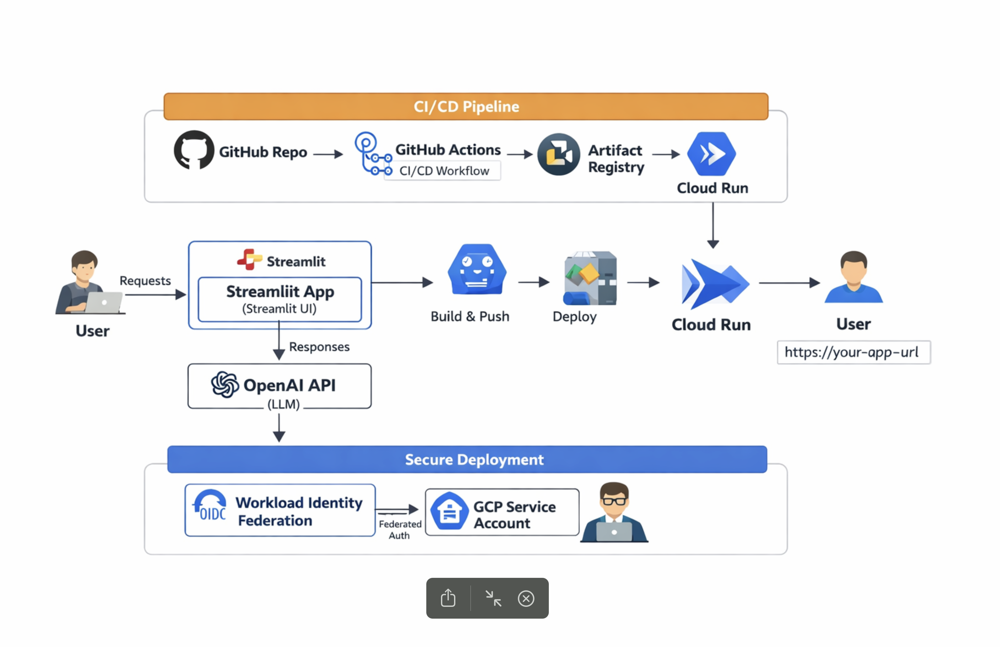

# 🚀 OpenAI Streamlit App
Built with ❤️ using OpenAI, Streamlit, Docker and Google Cloud Run.

### 🔗 Live App
```
https://ai-engineering-openai-465643475320.europe-west1.run.app/
```

## 🏗️ Architecture Diagram

>This diagram shows a simple flow of how the AI Streamlit app is working end-to-end. The user interacts with the Streamlit UI, which sends requests to the OpenAI API and returns the response back in real time. The app is packaged using Docker and deployed on Google Cloud Run. For deployment, GitHub Actions is used to automate the CI/CD pipeline, and authentication is handled securely using Workload Identity (OIDC), so no keys are required.
<p align="center">
  
</p>

## 🧑‍💻 Local Development

### 1. Create Virtual Environment
create a virtual environment
```
 $ python3 -m venv venv
```

### 2. Activate Environment
```
$ source venv/bin/activate
```
### 3. Install Dependencies
 ```
 $ pip install -r requirements.txt
 ```
 ### 4. Select Python Interpreter (VS Code)

```
•	Cmd + Shift + P (macOS)
```

## ⚙️ CI/CD Setup (GitHub Actions)
### 🔐 Required GitHub Secrets
```
GCP_PROJECT_ID=gcp-project-id
GCP_REGION=europe-west3
SERVICE_ACCOUNT_EMAIL=<NAME>@<PROJECT_ID>.iam.gserviceaccount.com
SERVICE_NAME=chatbot-service
WORKLOAD_IDENTITY_PROVIDER=projects/<PROJECT_NUMBER>/locations/global/workloadIdentityPools/<POOL_NAME>/providers/<PROVIDER_NAME>
```

## 🔑 Configure OIDC (Workload Identity)
```
$ gcloud iam workload-identity-pools providers update-oidc github-provider \
--location="global" \
--workload-identity-pool="github-pool" \
--attribute-condition="assertion.repository_owner=='Ranjit-Banglore'"
```

## 📦 Deployment

* > Containerized using Docker
* > Deployed on Google Cloud Run
* > Automated via GitHub Actions CI/CD pipeline

